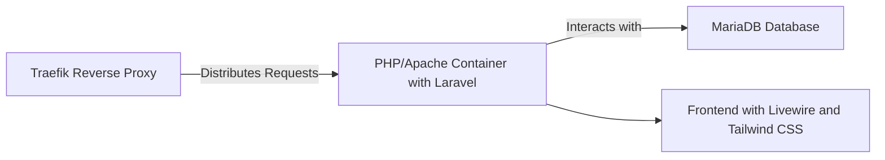
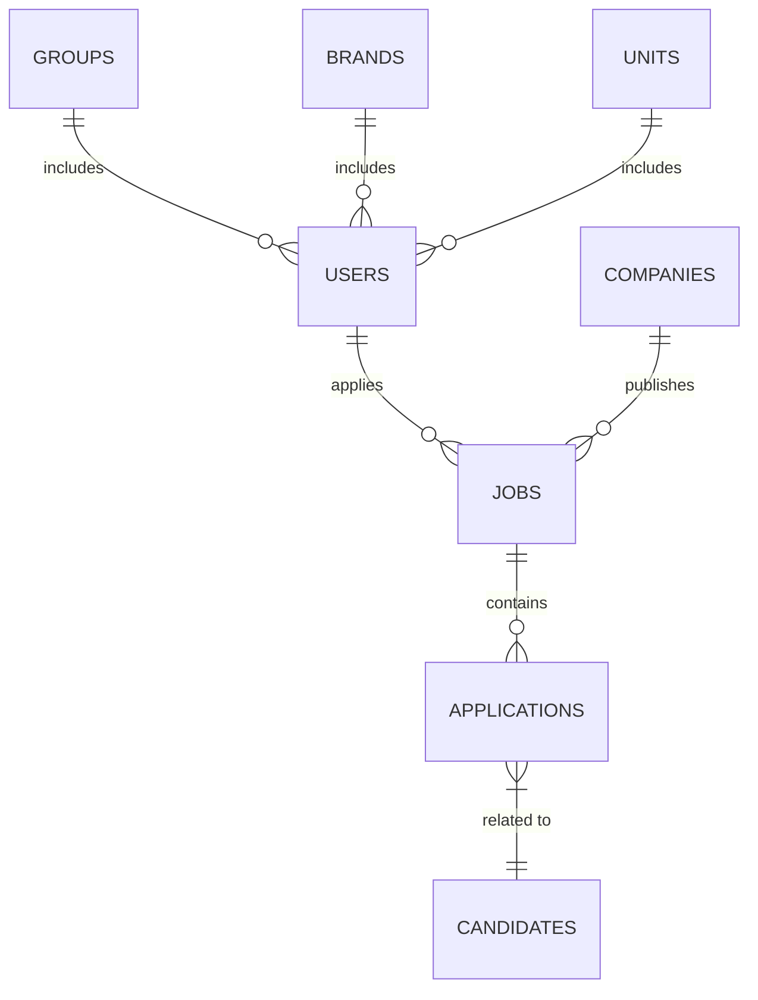
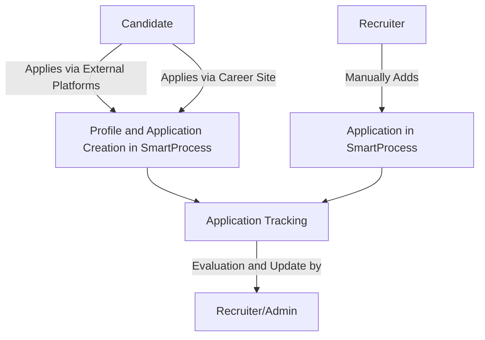

## Technical Documentation of SmartProcess ATS

### Overview

SmartProcess ATS is a recruitment management platform designed to optimize and simplify the recruitment process. It provides an intuitive interface for job offer creation, application management, and communication between recruiters and candidates.

### Current Features

1. **Job Offer Management**:

   - An interface for creating and managing job offers.
   - Ability to enter detailed information about the position.
   - Offers are stored in a database and can be modified or deleted by recruiters and administrators.

2. **Application Management**:

   ```mermaid
   graph LR
       A[Job Offer] -->|Receives| B[Applications]
       B -->|Processing| C[Tracking Interface]
       C -->|Viewing| D[Recruiter]
       C -->|Evaluation| D
       C -->|Status Update| D
       D -->|Feedback| E[Candidate]
   ```

   - Candidates can apply through external platforms like Google Jobs or LinkedIn, automatically creating their profile and application in SmartProcess.
   - Candidates can also apply via a career site.
   - Recruiters and administrators can manually add candidates and their applications.
   - Applications are tracked on a dedicated interface with features for viewing, evaluating, and updating the status of applications.

3. **Recruiter Space**:

   - Allows recruiters to manage the entire recruitment process, including interviews and candidate follow-ups.
   - Recruiters have access only to applications related to their company and specific level.

4. **Candidate Space**:

   - Candidates have access to a simplified dashboard to track the progress of their applications.

5. **Document Management Module**:

   - Manages various company and employment-related documents.

6. **Team Invitation System**:

   - Sends interview invitations via Microsoft Teams.

7. **Performance Metrics**:

   - Tracks visitor numbers, response rates, etc.

8. **Trimoji Integration**:

   - Integrates personality test results into candidate profiles.

9. **AI Writing Assistance**:

   - For job ads, LinkedIn posts, and job descriptions.

### Technical Characteristics



- **Frontend**: Developed with Tailwind CSS and Livewire.
- **Backend**: Uses Laravel and Filament.
- **Database**: MariaDB.
- **File Storage**: Managed in-house with local and remote backup.
- **Microservices Architecture**: Traefik as a reverse proxy, distributing requests to PHP/Apache/Node/Laravel and MariaDB containers.
- **Security**: GDPR compliant, with candidate control over video data.

### Data Structure



- Tables for users, CVs, job offers, companies, groups, test responses, etc.
- Specified foreign key relations to connect various data such as candidate information, job details, company profiles.

### User Roles

- **Administrators**: Manage recruitment processes.
- **Recruiters**: Handle end-to-end recruitment.
- **Candidates**: Create profiles, apply for jobs, track applications, and participate in video interviews.

### Recruitment Workflow



1. **Job Offer Management**: Creation and publication of job offers by client companies.
2. **Candidate Application**: Direct application on the platform.
3. **Personality Tests**: Optional service with access to test results.
4. **Candidate Evaluation**: Suggestions aligned with market practices.
5. **Application Tracking**: Suggestions aligned with market practices.
6. **Interactions Between Companies and Candidates**: Via external messaging tools.


