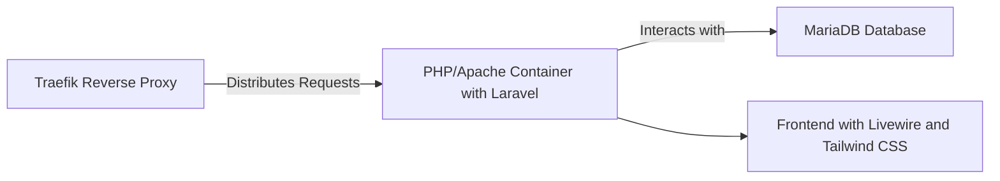
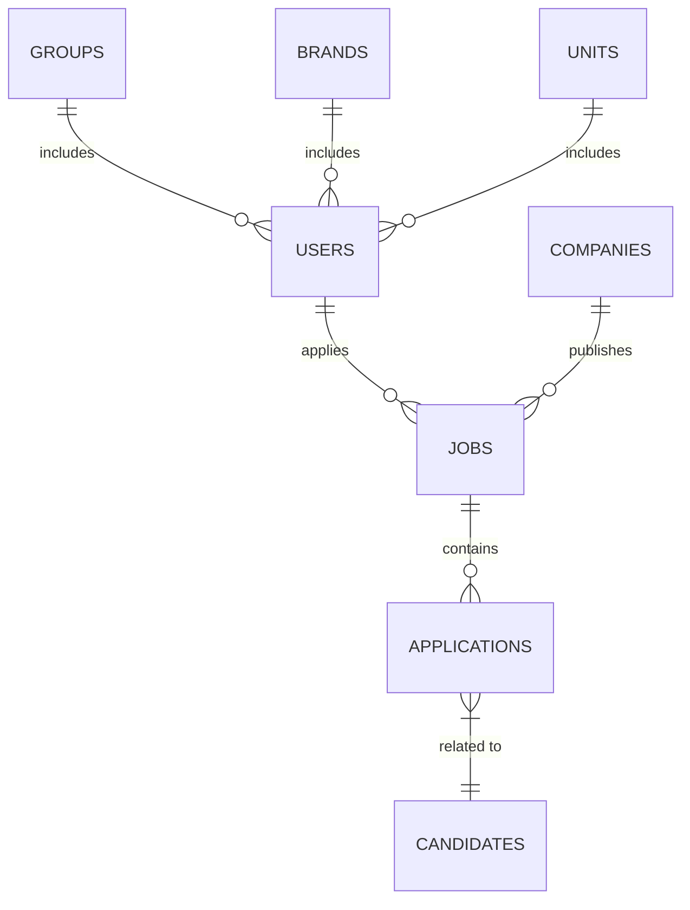
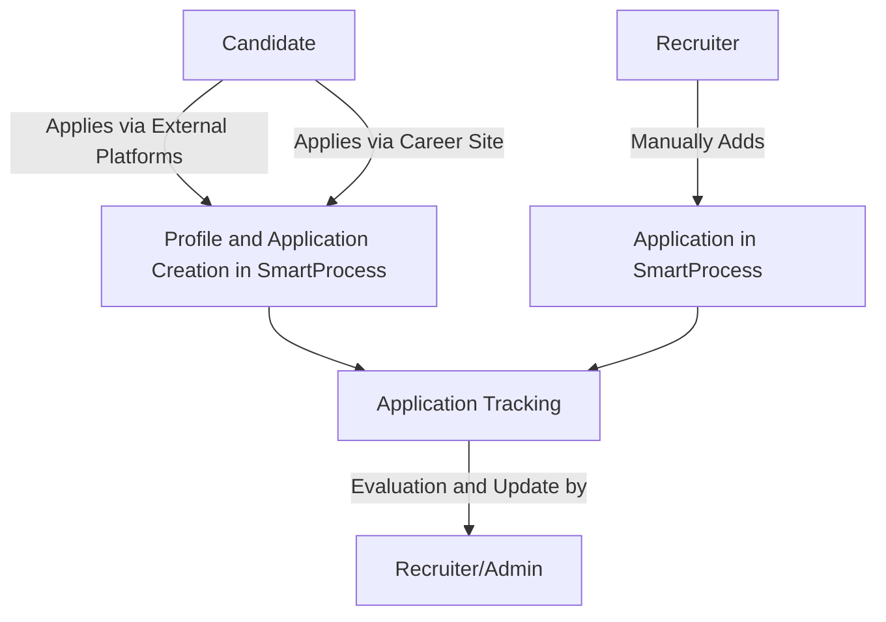

# Project Documentation for SmartProcess ATS Platform

## Introduction

### Project Context

SmartProcess aims to develop a professional tool in the form of an Applicant Tracking System (ATS) platform. This solution is intended to manage and track applications for SmartProcess's client companies. Currently, SmartProcess relies on TalentView, a costly third-party platform, and HelloWork. The new tool will replace TalentView while coexisting with HelloWork.

### Project Objectives

- Develop a reliable and scalable web platform for efficient tracking of applications and recruitment processes.
- Establish a solid data structure to support key ATS functionalities.
- Integrate with third-party services like Trimoji to enhance existing features and add new functionalities or existing recruitment platforms like google jobs or 
- Ensure high-quality user experience while adhering to data security and privacy standards.

### Target Audience and End Users

The target audience includes SmartProcess's client companies needing an efficient system for their recruitment processes. End users will primarily be recruitment managers in these companies, candidates applying through the system, and SmartProcess employees who will have administrative access to the platform.

## System Overview

### Job Management

Recruitment managers and SmartProcess administrators can create, publish, update, or delete job offers on the platform.

### Application Management

Candidates can apply for jobs, and recruiters/administrators can view, evaluate, and track these applications through the recruitment process.

There is 3 levels of recruiters : Group managers, Brand managers and Business manager. Group can create Brand and Business accounts and see their data. Brand can create Business accounts and view their data. 

### Candidate Profile Creation and Management

Candidates can create and manage their profiles, containing information like CVs, and introductory videos. They can also track their application status.

### Communication Tools

The platform will offer communication tools, including video introduction recording and video conferencing for interviews.

The platform will also intergrate api call to openAi chatgpt to assist ads writing or other tasks like CV analysis. 

### Trimoji Integration

Integration with Trimoji for personality tests, with results added to candidate profiles.

### Subscription Level Management

Client companies can choose from different subscription levels, determining the level of assistance provided by SmartProcess administrators during recruitment.

### Job Posting Tool

Clients can disseminate job offers on third-party sites using a JavaScript code provided by the platform or create specific posts for various social networks.

They can also share job offers on third party sites like google jobs or indeed and mentionned in the mockup.

### Development Technologies

The functionalities will be developed using Laravel and FilamentPHP for the backend, and Livewire for the frontend. The platform will be hosted on a web server and accessible via a web browser.

## Data Structure

### Key Tables

- **Users**: Stores general information about all platform users (candidates, recruiters, SmartProcess administrators).
- **Applicants**: Contains specific information about candidates, linked to Users.
- **Jobs**: Details about job offers, linked to Companies.
- **Companies**: Information about client companies, linked to a group for organization.
- **Applications**: Stores applications, linking candidates, jobs, and CVs.
- **CVs**: Stores CVs uploaded by candidates.
- **hr_managers**: Information about HR users, including contact details and company links.
- **Test_Responses and Personality_Tests**: Stores personality test information and candidate responses.
- **Company_Docs**: Documents related to client companies.
- **Evaluations**: Manages candidate evaluation processes.
- **Introductions and Job_Documents**: Manages candidate introductions and job-related documents.
- **Meetings**: Manages meetings between HR and candidates, including time, place, and related job information.

These tables are interconnected with foreign key relations for a robust and flexible data structure.

## Technical Architecture

### Stack

- **Backend**: Laravel with MariaDB for database management. Asynchronous tasks might integrate Redis in the future.
- **Frontend**: Tailwind CSS and Livewire within Laravel.
- **Hosting and Deployment**: Docker microservices infrastructure, including a Traefik reverse proxy container, PHP/Apache/Node/Laravel container, MariaDB service container, and optional cache service. Continuous deployment via GitLab.
- **File Storage and Email Management**: Handled internally with local and remote backups for data security. Email managed via an internal Postal-type service.

## Key Features

### Job Management

Companies can create and publish job offers with details like position, work description, required qualifications, and visibility control.

### Candidate Applications

Candidates can apply directly to offers, track application status, receive new offer proposals, and indicate future contact preferences.

### Personality Tests

Optional personality tests for candidates, with results accessible to client companies.

*Note: The timeline is indicative and subject to change based on development progress and feedback.*


## Technical Documentation of SmartProcess ATS

### Overview

SmartProcess ATS is a recruitment management platform designed to optimize and simplify the recruitment process. It provides an intuitive interface for job offer creation, application management, and communication between recruiters and candidates.

### Current Features

1. **Job Offer Management**:

   - An interface for creating and managing job offers.
   - Ability to enter detailed information about the position.
   - Offers are stored in a database and can be modified or deleted by recruiters and administrators.

2. **Application Management**:

   ```mermaid
   graph LR
       A[Job Offer] -->|Receives| B[Applications]
       B -->|Processing| C[Tracking Interface]
       C -->|Viewing| D[Recruiter]
       C -->|Evaluation| D
       C -->|Status Update| D
       D -->|Feedback| E[Candidate]
   ```

   - Candidates can apply through external platforms like Google Jobs or LinkedIn, automatically creating their profile and application in SmartProcess.
   - Candidates can also apply via a career site.
   - Recruiters and administrators can manually add candidates and their applications.
   - Applications are tracked on a dedicated interface with features for viewing, evaluating, and updating the status of applications.

3. **Recruiter Space**:

   - Allows recruiters to manage the entire recruitment process, including interviews and candidate follow-ups.
   - Recruiters have access only to applications related to their company and specific level.

4. **Candidate Space**:

   - Candidates have access to a simplified dashboard to track the progress of their applications.

5. **Document Management Module**:

   - Manages various company and employment-related documents.

6. **Team Invitation System**:

   - Sends interview invitations via Microsoft Teams.

7. **Performance Metrics**:

   - Tracks visitor numbers, response rates, etc.

8. **Trimoji Integration**:

   - Integrates personality test results into candidate profiles.

9. **AI Writing Assistance**:

   - For job ads, LinkedIn posts, and job descriptions.

### Technical Characteristics



- **Frontend**: Developed with Tailwind CSS and Livewire.
- **Backend**: Uses Laravel and Filament.
- **Database**: MariaDB.
- **File Storage**: Managed in-house with local and remote backup.
- **Microservices Architecture**: Traefik as a reverse proxy, distributing requests to PHP/Apache/Node/Laravel and MariaDB containers.
- **Security**: GDPR compliant, with candidate control over video data.

### Data Structure



- Tables for users, CVs, job offers, companies, groups, test responses, etc.
- Specified foreign key relations to connect various data such as candidate information, job details, company profiles.

### User Roles

- **Administrators**: Manage recruitment processes.
- **Recruiters**: Handle end-to-end recruitment.
- **Candidates**: Create profiles, apply for jobs, track applications, and participate in video interviews.

### Recruitment Workflow



1. **Job Offer Management**: Creation and publication of job offers by client companies.
2. **Candidate Application**: Direct application on the platform.
3. **Personality Tests**: Optional service with access to test results.
4. **Candidate Evaluation**: Suggestions aligned with market practices.
5. **Application Tracking**: Suggestions aligned with market practices.
6. **Interactions Between Companies and Candidates**: Via external messaging tools.


